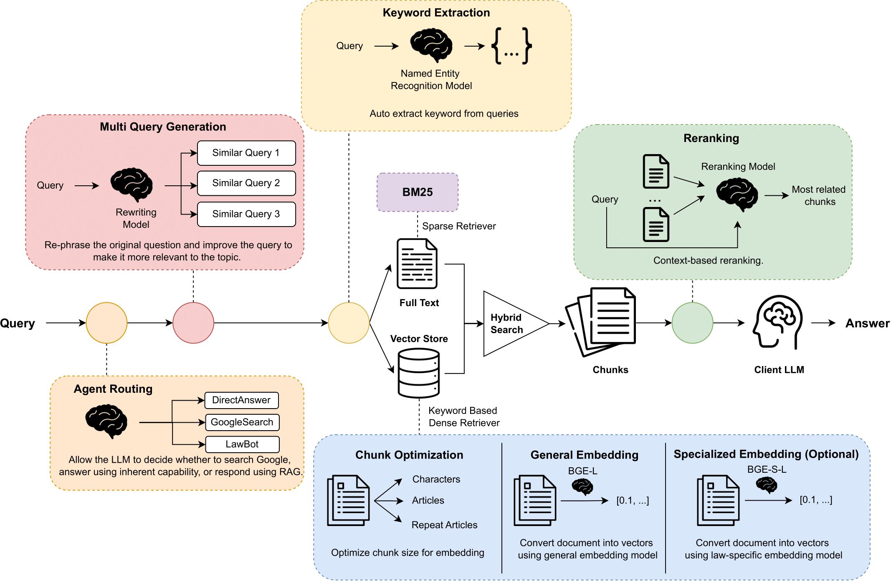

# LawBot: Enhancing LLMs with RAG for Legal Precision

## Introduction
LawBot is a simple yet effective framework tailored to specialized legal domains, operational without training. Utilizing Chinese legal and regulatory documents as the knowledge base, LawBot enhances the breadth of retrieval through multi-query generation and hybrid search strategies. It increases precision with metadata filtering and confirms the plausibility of knowledge through context-based reranking. Remarkably, all these procedures are conducted via zero-shot prompting, making LawBot broadly applicable even when LLMs are accessible only through a black-box API.

  <!-- Ensure this is a link to an image file, not a PDF -->

## Installation

Follow these steps to set up the LawBot environment on your local machine:

1. Clone the repository:
   ```bash
   git clone https://github.com/yix8/LawBot.git
   ```
2. Navigate to the LawBot directory:
   ```bash
   cd LawBot
   ```
3. Install the required packages:
   ```bash
   pip install -r requirements.txt
   ```
4. Build the general vector store:
   ```bash
   python framework/embed_laws.py
   ```
5. Build the specific vector store:
   ```bash
   python framework/finetune_data/embed_query.py
   ```

## Configuration

Set up the necessary API keys in the `.env` file located in the `framework` folder:

- `OPENAI_API_KEY`: Your OpenAI API key for GPT-3 access.
- `COHERE_RERANK_KEY`: Your Cohere rerank API key.
- `LANGCHAIN_API_KEY`: Your LangChain API key.
- `LANGCHAIN_PROJECT`: Your LangChain project identifier.

## Running LawBot
To interact with the model via a web interface:
   ```bash
   python framework/App.py
   ```

